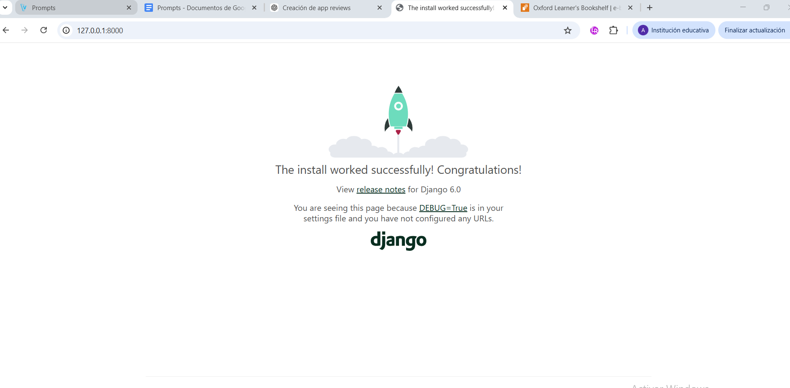
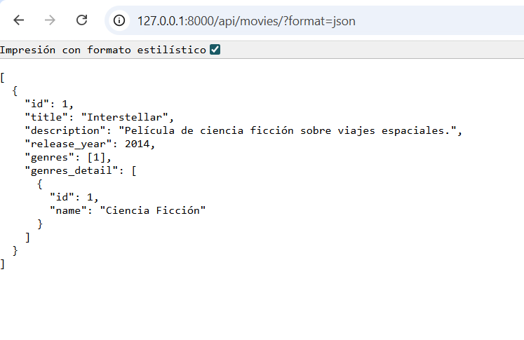
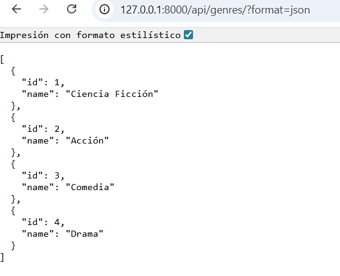
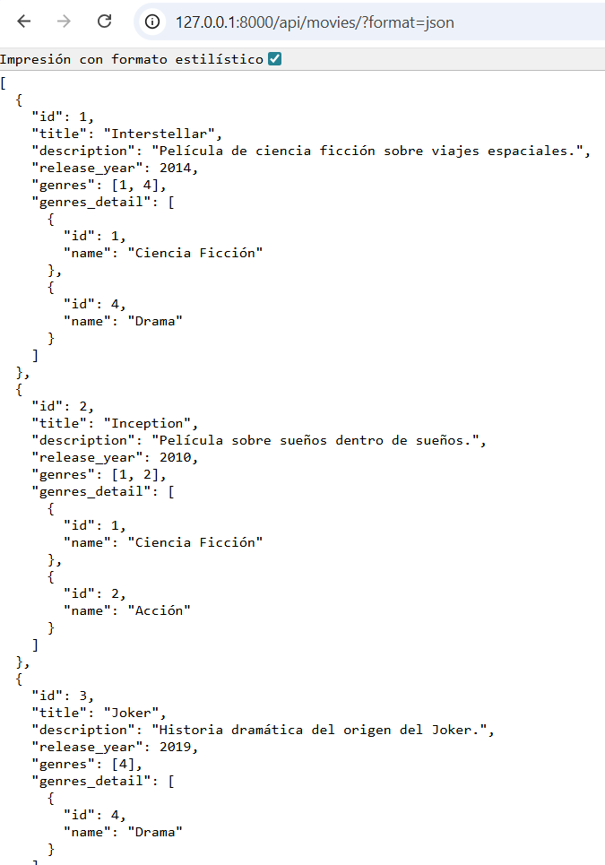
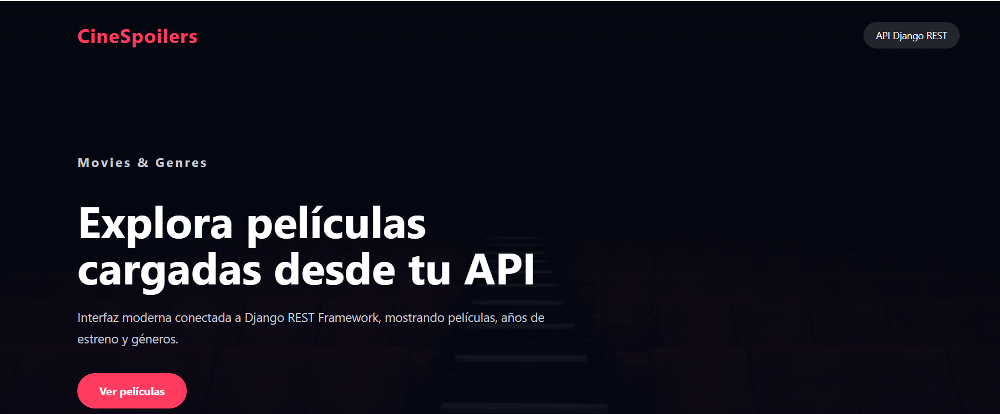
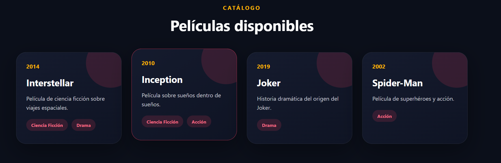

# Cinespoilers

Proyecto desarrollado con Django REST Framework.

## Tecnologías usadas

- Python
- Django
- Django REST Framework
- SQLite

---

## Levantando el Proyecto

---

### Endpoint Movies JSON

---

## Relación Movie - Genre

### Movies con géneros

---

## Carga automática de datos

## Ejecución del comando seed_data

---

## Endpoint Movies con data automática

---

# Frontend CineSpoilers

## Interfaz principal conectada a la API

---

## Catálogo de películas renderizado desde Django REST API

