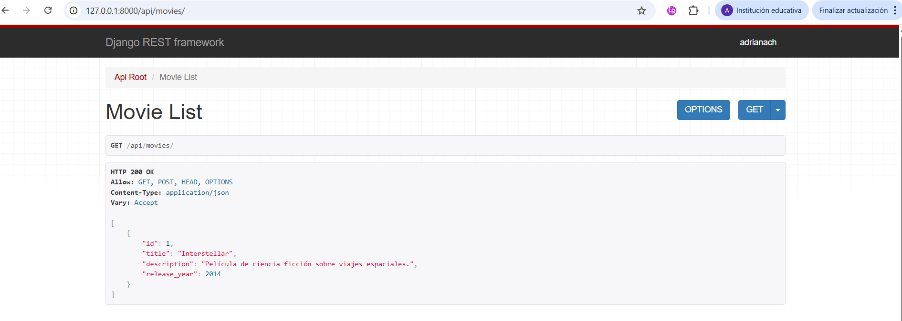

# Cinespoilers

Proyecto desarrollado con Django REST Framework.

## Tecnologías usadas

- Python
- Django
- Django REST Framework
- SQLite

---

## Levantando el Proyecto

---

### Endpoint Movies JSON

---

## Relación Movie - Genre

### Movies con géneros

---